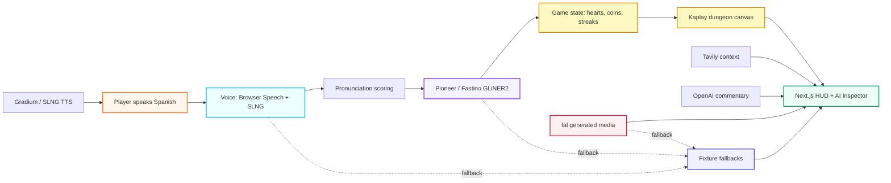

# Sora the Explorer

**A voice-powered AI roguelike for the {Tech: Europe} Paris AI Hackathon.**

Speak Spanish. Survive the dungeon. Watch the AI pipeline light up.


<p align="center">
  
  
  
  
  
  
  
  
</p>

**Quick links:** [Quick Start](#quick-start) · [Architecture](#architecture) · [Hackathon Fit](#hackathon-fit) · [Tech Stack](#tech-stack)

## What It Is

**Sora the Explorer** turns language practice into a live AI dungeon run. The player hears a Spanish phrase, says it into the mic, gets scored, and advances through the **Moonlit Bodega** while the app shows which AI systems are working behind the scenes.

**The magic moment:** in under a minute, a judge can see voice input become pronunciation scoring, structured Pioneer intent, game progression, generated art, and visible provider telemetry.

## Demo Preview


| Merchant | Enemy | Boss |
| --- | --- | --- |
|  |  |  |


## Why It Wins

| Hackathon asks for | Sora delivers | How it exceeds the bar |
| --- | --- | --- |
| **Creative project** | A voice-first language roguelike with generated art, music, and a live dungeon loop | It is not a wrapper or chatbot: it is a playable game with scoring, hearts, coins, rooms, and progression |
| **Technical complexity** | Next.js + FastAPI + Kaplay + six AI/provider integrations | Real-time voice, structured extraction, fallback contracts, benchmark scripts, and game state all work together |
| **Use at least 1 partner technology** | Uses Pioneer/Fastino, fal, SLNG, Gradium, OpenAI, and Tavily | Covers the main Open Innovation path plus multiple side challenges |
| **Comprehensive README** | Setup, architecture, APIs, stack, provider map, verification commands | Written for jury evaluation, not just local dev |
| **2-minute live walkthrough** | First 15 seconds show title, dungeon, speech, score, and AI telemetry | Demo is resilient even when keys or venue Wi-Fi fail |

## Architecture



## Sponsor Strategy

| Sponsor | What it does in the product | Prize alignment |
| --- | --- | --- |
| **Pioneer / Fastino** | Extracts structured game intent from spoken language with GLiNER2 | Best use of Pioneer: creative GLiNER2 use case, benchmarked against a general LLM path |
| **fal** | Drives generated visual identity: title scene, dungeon map, rooms, character, optional LoRA workflow | Best use of fal: generative media is core to the experience, not decoration |
| **SLNG** | Voice path for speech interaction | Best use of SLNG: voice is part of the main gameplay loop |
| **Gradium** | Text-to-speech examples for phrases | Finalist prize partner usage through practical realtime TTS |
| **OpenAI** | Commentary and benchmark baseline | Used where a frontier model is helpful, not where GLiNER2 is the stronger fit |
| **Tavily** | Cultural/lore context and citations | Adds grounded context and proof chips for jury inspection |

## Tech Stack

| Layer | Tools | Why |
| --- | --- | --- |
| **Game UI** | Next.js 16, React 19, Kaplay | Fast iteration, full-screen presentation, real canvas-based game feel |
| **Backend** | FastAPI, Pydantic, Python services | Server-side API keys, typed contracts, clean provider wrappers |
| **Voice** | Browser Speech API, SLNG, Gradium | Low-latency demo path plus sponsor-backed voice capabilities |
| **AI extraction** | Pioneer / Fastino GLiNER2 | Structured low-latency game intent instead of overusing a general LLM |
| **Media** | fal, LoRA-ready workflow, generated assets | Visual wow for title, map, rooms, and character |
| **Context + flavor** | Tavily, OpenAI | Citations, commentary, and comparison baseline |
| **Resilience** | Fixtures, deterministic scoring, fallback provider states | The stage demo works with or without every external API |

## Gameplay Loop

1. Press **Play Adventure**.
2. Enter the Kaplay-rendered Moonlit Bodega.
3. Hear a Spanish phrase.
4. Speak into the mic.
5. Get a pronunciation score.
6. Pioneer extracts structured intent: `action`, `target`, `intent`.
7. Success gives coins and streaks.
8. Misses cost hearts.
9. Clear the merchant, enemy, and boss rooms.
10. Open the AI Inspector to show live/fallback provider proof.

## Quick Start

### Backend

```bash
python3 -m venv backend/.venv
backend/.venv/bin/python -m pip install -r backend/requirements.txt
cd backend
.venv/bin/uvicorn app.main:app --host 127.0.0.1 --port 8000
```

### Frontend

```bash
cd frontend
npm install
npm run dev -- --hostname 127.0.0.1 --port 3000
```

Open:

```text
http://127.0.0.1:3000
```

## Environment

Copy `.env.example` to `.env` and add only the keys you want to test live:

```bash
PIONEER_API_KEY=...
PIONEER_INTENT_MODEL_ID=...
FAL_KEY=...
FAL_LORA_URL=...
SLNG_API_KEY=...
GRADIUM_API_KEY=...
OPENAI_API_KEY=...
TAVILY_API_KEY=...
NEXT_PUBLIC_API_BASE=http://127.0.0.1:8000
```

All sponsor keys stay server-side. The browser only receives `NEXT_PUBLIC_API_BASE`.

## Verification

```bash
curl -sf http://127.0.0.1:8000/health

curl -sf -X POST http://127.0.0.1:8000/api/dungeon/start \
  -H 'Content-Type: application/json' \
  -d '{"language":"es-ES"}'

curl -sf -X POST http://127.0.0.1:8000/api/pronunciation/score \
  -H 'Content-Type: application/json' \
  -d '{"transcript":"cuanto cuesta","targetPhrase":"¿Cuánto cuesta?","language":"es-ES"}'

cd frontend && npm run build
```

With live keys:

```bash
backend/.venv/bin/python backend/scripts/smoke_sponsors.py
backend/.venv/bin/python backend/scripts/run_intent_benchmark.py \
  --fixtures docs/eval-sora-intents.json \
  --out docs/pioneer-bench-sora.json
```

## API Surface

| Route | Purpose |
| --- | --- |
| `GET /health` | Backend health check |
| `POST /api/dungeon/start` | Start a Sora run |
| `POST /api/dungeon/advance` | Move to the next room or victory |
| `POST /api/pronunciation/score` | Score speech and call Pioneer intent extraction |
| `POST /api/voice/transcribe` | Voice transcription path |
| `POST /api/voice/speak` | Phrase TTS path |
| `POST /api/creature/sprite` | fal visual-generation path |
| `POST /api/creature/lore` | Tavily lore/citation path |
| `POST /api/commentary` | OpenAI commentary path |
| `POST /api/battle` | Battle simulation route |

## Repository Map

```text
backend/
  app/routes/       FastAPI routes for dungeon, voice, sprites, lore, commentary
  app/services/     Sponsor adapters, scoring, fallbacks
  app/fixtures/     Demo-safe room, creature, lore data
  scripts/          Benchmarks, smoke tests, training helpers

frontend/
  app/              Next.js entry
  components/dungeon/
                    Sora gameplay, Kaplay canvas, HUD, scoring flow
  components/pipeline/
                    Sponsor proof panels
  public/assets/    Generated art and music

docs/
  pioneer-bench-sora.json
  eval-sora-intents.json
  track-brief.md
  architecture.md
```

## Demo Resilience

Every external path has a truthful fallback:

| If this fails | Demo still does this |
| --- | --- |
| Pioneer key/API | Keyword fixture returns structured intent |
| fal key/API | Deterministic visual fallback keeps UI alive |
| SLNG / Gradium | Browser speech and text fallback preserve flow |
| Tavily | Fixture citations still render |
| OpenAI | Deterministic commentary still appears |

No fake training claims, no client-side secrets, no blank screen.

## Hackathon Fit

The manual asks for a newly created project, at least one partner technology, a 2-minute demo, a public GitHub repo, setup instructions, API/framework/tool documentation, and enough technical detail for jury evaluation.

Sora matches all of that and goes further:

- **Open Innovation:** a creative, playable AI game.
- **Fastino/Pioneer:** GLiNER2 is core to game intent extraction, with benchmark artifacts.
- **fal:** generative media is central to the visual experience.
- **SLNG:** voice is part of the main interaction loop.
- **Finalist readiness:** clear 5-minute story, visible technical depth, and live-demo resilience.

## One-Line Pitch

> **Sora turns language learning into a live AI dungeon: Pioneer understands what you said, fal makes the world visible, voice makes it playable, and the whole stack is resilient enough for a hackathon stage.**
